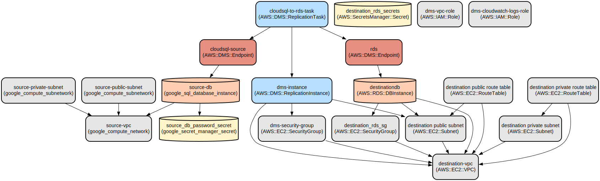

# Cloud Database Migration Infrastructure as Code

This project provides an automated infrastructure setup for migrating data between Google Cloud SQL and Amazon RDS databases using AWS Database Migration Service (DMS). It implements a secure, scalable architecture with proper networking, security, and secret management configurations.

The infrastructure is defined using Terraform and supports bi-directional database migration between GCP and AWS cloud platforms. The solution includes VPC configurations, subnet management, security groups, and secret management in both cloud environments, ensuring secure and reliable data transfer.

## Repository Structure
```
terraform/
├── main.tf                 # Main infrastructure configuration file
├── provider.tf             # Cloud provider configurations (AWS, GCP, Vault)
├── variables.tf            # Global variable definitions
├── outputs.tf             # Infrastructure output definitions
└── modules/               # Reusable infrastructure modules
    ├── aws/              # AWS-specific modules
    │   ├── dms/         # Database Migration Service configuration
    │   ├── rds/         # RDS database setup
    │   ├── secrets-manager/ # AWS Secrets Manager configuration
    │   └── vpc/         # AWS VPC and networking components
    └── gcp/              # GCP-specific modules
        ├── cloud-sql/   # Cloud SQL database setup
        ├── network/     # GCP networking components
        └── secret-manager/ # GCP Secret Manager configuration
```

## Usage Instructions
### Prerequisites
- Terraform >= 1.0
- AWS CLI configured with appropriate credentials
- Google Cloud SDK installed and configured
- HashiCorp Vault for secrets management
- IAM roles and permissions for:
  - AWS DMS
  - RDS
  - VPC management
  - Secrets Manager
  - GCP Cloud SQL
  - GCP VPC
  - GCP Secret Manager

### Installation

1. Clone the repository:
```bash
git clone <repository-url>
cd terraform
```

2. Initialize Terraform:
```bash
terraform init
```

3. Configure your cloud credentials:

For AWS:
```bash
export AWS_ACCESS_KEY_ID="your-access-key"
export AWS_SECRET_ACCESS_KEY="your-secret-key"
```

For GCP:
```bash
export GOOGLE_APPLICATION_CREDENTIALS="path/to/your/credentials.json"
```

### Quick Start

1. Review and modify variables in `variables.tf`:
```hcl
variable "source_location" {
  default = "us-central1"
}
variable "destination_location" {
  default = "us-east-1"
}
```

2. Plan the infrastructure:
```bash
terraform plan
```

3. Apply the configuration:
```bash
terraform validate
terraform apply
```

### More Detailed Examples

1. Creating a custom VPC configuration:
```hcl
module "source_vpc" {
  source = "./modules/gcp/network/vpc"
  vpc_name = "custom-vpc"
  auto_create_subnetworks = false
  routing_mode = "REGIONAL"
}
```

2. Setting up Cloud SQL instance:
```hcl
module "source_db" {
  source = "./modules/gcp/cloud-sql"
  name = "custom-db"
  db_name = "mydb"
  db_version = "MYSQL_8_0"
  tier = "db-f1-micro"
}
```

### Troubleshooting

1. VPC Peering Issues
- Error: "VPC peering connection failed"
  ```bash
  # Verify VPC configurations
  terraform show | grep vpc_id
  # Check GCP VPC peering status
  gcloud compute networks peerings list
  ```

2. DMS Connectivity Issues
- Error: "Unable to connect to source/target database"
  ```bash
  # Verify security group rules
  aws ec2 describe-security-groups --group-ids <security-group-id>
  # Check DMS task logs
  aws dms describe-replication-task-logs --replication-task-arn <task-arn>
  ```

## Data Flow
The infrastructure enables data migration between GCP Cloud SQL and AWS RDS through AWS DMS.

```ascii
+-------------+     +----------+     +-------------+
|  Cloud SQL  | --> |   DMS   | --> |    RDS     |
| (Source DB) |     |(AWS)    |     |(Target DB) |
+-------------+     +----------+     +-------------+
```

Component Interactions:
1. Source database (Cloud SQL) is configured with private IP and authorized networks
2. DMS replication instance runs in AWS VPC with appropriate security groups
3. DMS connects to source database using public IP or private connectivity
4. Target RDS instance runs in private subnet with security group rules
5. Secrets are managed through respective cloud secret managers
6. VPC configurations ensure secure network communication
7. DMS task performs the actual data migration with specified rules

## Infrastructure



### Lambda Functions
- None defined in current infrastructure

### VPC Resources
- AWS VPC with public/private subnets
- GCP VPC with public/private subnets
- Security groups and firewall rules
- NAT Gateways and Internet Gateways

### Database Resources
- GCP Cloud SQL instance (MySQL 8.0)
- AWS RDS instance (MySQL 8.0)
- Database subnet groups
- Database security groups

### DMS Resources
- DMS replication instance
- Source and target endpoints
- Replication subnet group
- DMS IAM roles and policies

### Secret Management
- AWS Secrets Manager for RDS credentials
- GCP Secret Manager for Cloud SQL credentials
- Integration with HashiCorp Vault

## Deployment

1. Prerequisites:
- Vault server running with secrets configured
- Required IAM roles and permissions
- Network connectivity between clouds

2. Deployment Steps:
```bash
# 1. Initialize Terraform
terraform init

# 2. Validate configuration
terraform validate

# 3. Review planned changes
terraform plan

# 4. Apply changes
terraform apply

# 5. Verify resources
terraform show
```

3. Environment Configuration:
- Update `provider.tf` with appropriate region and project details
- Configure Vault secrets at specified paths
- Adjust variable values in `variables.tf` as needed

4. Monitoring:
- Enable CloudWatch logging for DMS tasks
- Monitor replication task status through AWS console
- Check database metrics in respective cloud consoles